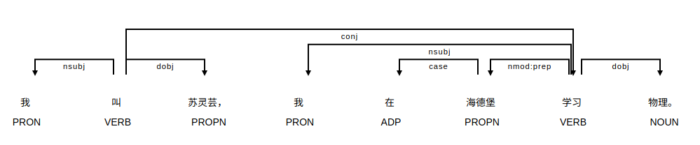

# Visualization of Word Dependencies & Named Entities in Chinese Texts

Learner of Chinese language have to overcome several challenges that do not occur in most other languages. The huge number of different characters as well as the pronunciation using different tones are just two of them. Moreover, due to special grammar structures, it is often hard to identify word dependencies in Chinese sentences. This applies in particular to long sentences as they occur e.g. in newspaper articles. Additionally, named entities usually consist of characters that also occur in other words. For this reason, it is often not straight forward to detect named entities within Chinese sentences.

In this project a python implementation using SpaCy.io for visualizing word dependencies and named entities in Chinese texts is offered.

The following images show two examples of these visualizations.

**Word dependencies:**

**Named-Entity-Recognition (NER):**

